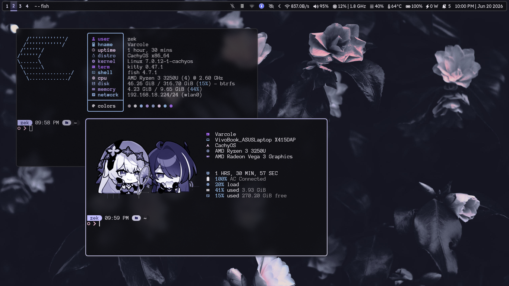
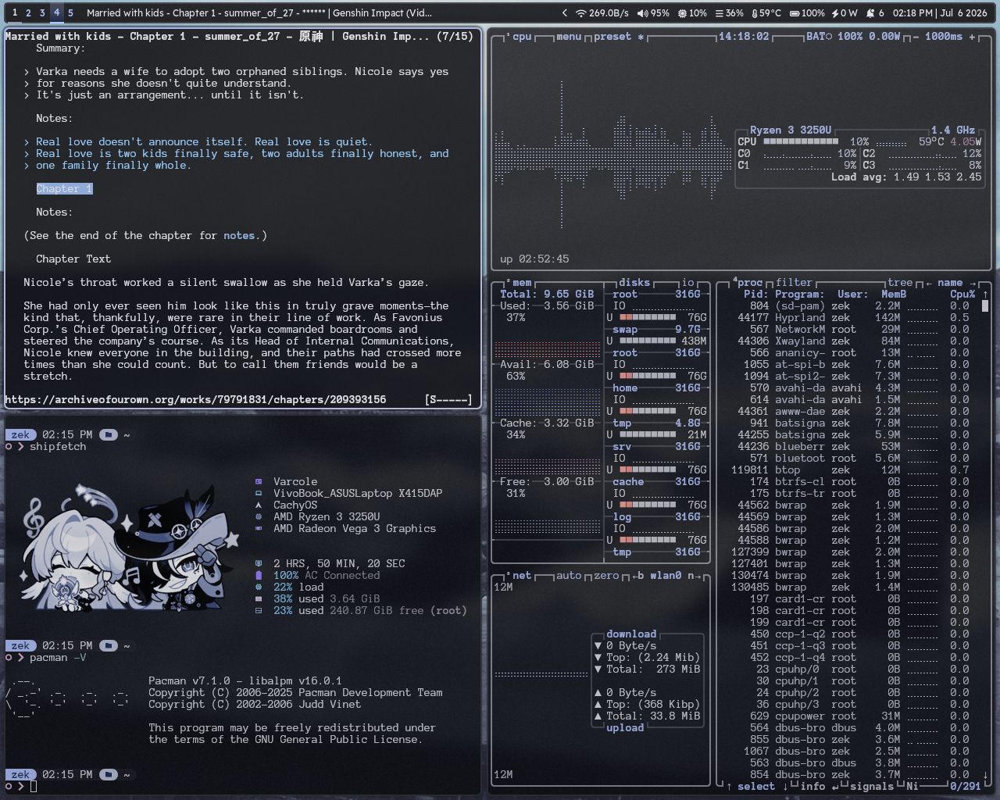
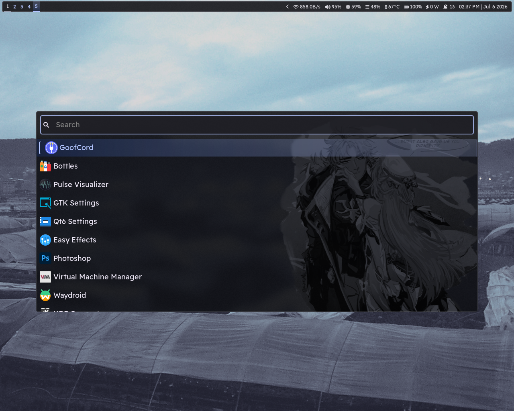
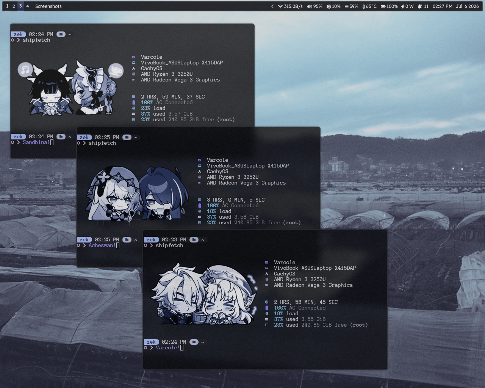

# EiMikOS dotfiles
~we don't need shells where we're going~

| rmpc + pulse-visualizer | shipfetch + ao3 on elinks + btop |
| :- | :- |
|  |  |
| wofi ([artwork by @mintothesoul](https://x.com/mintothesoul/status/2013006326125789365)) | shipfetches |
|  |  |

## Installation?

Aside from installing [the packages below](#most-packages-used), this dotfiles repo is managed by [chezmoi](https://www.chezmoi.io/) so if you clone this repo you will have to manually rename the directories modified by it (ie. `private_dot_config` to `.config`) before using it.  
You can also download the tar from [releases](https://github.com/zekchard/dotfiles/releases/latest) and untar it in your home directory.

## (most) packages used

> [!IMPORTANT]
> This assumes that you are using these dotfiles with Arch Linux et al., also highly recommended that you have [chaotic-aur](https://aur.chaotic.cx) installed in your pacman repos

### toolkit themes and stuff
| | |
| :- | :- |
| Qt | `aur/darkly-bin` |
|| or alternatively, `extra/kvantum` |
||`extra/qt5ct`|
||`extra/qt6ct`|
| GTK | [`adw-gtk-theme`](https://github.com/lassekongo83/adw-gtk3) in `~/.local/share/themes` |
||`extra/nwg-look`|
| Icons | `chaotic-aur/papirus-folders` [with extra setup](https://github.com/InioX/matugen-themes#papirus-folders) |
| Cursor | [`bibata-cursor-theme`](https://github.com/ful1e5/Bibata_Cursor) in `~/.local/share/icons` |

### fonts
|font name|repo/package-name|
|-|-|
|Readex Pro|`chaotic-aur/ttf-readex-pro`|
|Anonymice Pro Nerd Font|`extra/ttf-anonymouspro-nerd`|

### utilities, eye candy whatever
|purpose|repo/package-name|
| :- | :- |
| Window Manager and Compositor | `extra/hyprland` |
| Theming Engine | `extra/matugen` |
|  | `chaotic-aur/python-materialyoucolor` for the [universal terminal colors template]( https://github.com/InioX/matugen-themes/pull/132) to work|
| Terminal | `extra/kitty` |
| Status Bar | `extra/waybar` |
| Notifications | `extra/swaync` |
| On-Screen-Display | `extra/swayosd` |
| Login Manager | `extra/ly` |
| File Manager (gui) | `extra/nautilus` |
| File Manager (tui) | `extra/yazi` |
| Fetcher | `extra/fastfetch` |
|  | [`./scripts/shipfetch`](./scripts/shipfetch) needs `extra/imagemagick` to work |
| Wallpaper Daemon | `chaotic-aur/waypaper-git` |
|  | `extra/awww` |
| Power Menu | `chaotic-aur/wlogout` |
| Lock Screen | `extra/hyprlock` |
| Color Picker | `extra/hyprpicker` |
| Screenshots | `extra/hyprshot` |
| Idle Manager | `extra/hypridle` |
| Launcher | `extra/wofi` |
| Clipboard | `extra/cliphist` |
| Shell Prompt | `extra/starship` |
| Text Editor | `extra/micro` |
| Browser | `chaotic-aur/zen-browser-bin` |
|  | see [zen-notes.md](./zen-notes.md) for more info |
| Discord Client | `chaotic-aur/goofcord-bin` |
| Wireless Managers | `extra/network-manager-applet` |
|  | `aur/blueberry-wayland` |
| Yellow tinter for your eyes | `extra/wlsunset` |
| Battery Notifications | `extra/batsignal` |
| Screen Recorder | `chaotic-aur/wl-screenrec` |
| Audio Visualizer | `aur/pulse-visualizer-git` |
| Music Player | `extra/rmpc` |
| spotify for some reason | `chaotic-aur/spotify` |
| theming/plugins engine for `spotify` | `chaotic-aur/spicetify-cli` |
